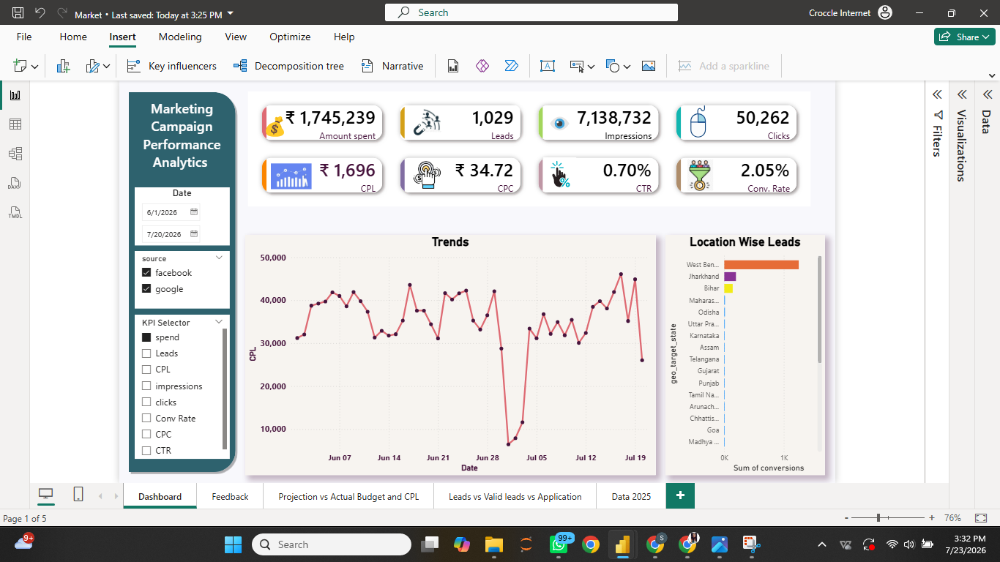
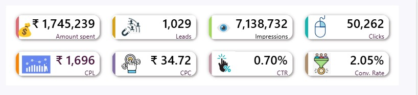
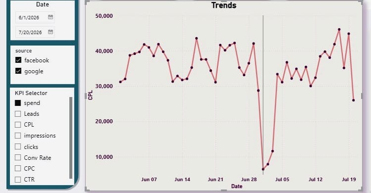

# Marketing Campaign Performance Analysis Dashboard

An interactive **Business Intelligence dashboard** developed using **Power BI** to monitor and analyze digital marketing campaign performance through key performance indicators (KPIs), campaign trends, lead generation metrics, budget utilization, and conversion analysis.

## Project Overview

The **Marketing Campaign Performance Analytics Dashboard** provides a centralized view of marketing campaign performance by transforming raw campaign data into meaningful business insights. It enables marketing teams and decision-makers to monitor campaign effectiveness, optimize budget allocation, track lead generation, and evaluate overall marketing performance through interactive visualizations.
The dashboard is designed with dynamic filters, KPI cards, and trend analysis to support faster, data-driven decision-making.

## Project Summary

| Category | Details |

| Domain | Digital Marketing Analytics |
| Tool | Microsoft Power BI |
| Data Source | Excel |
| Dashboard Type | Business Intelligence |
| KPIs | 8 |
| Interactive Filters | Date, Platform, KPI Selector |

## Business Problem

Marketing teams often execute campaigns across multiple platforms, making it challenging to monitor overall performance and identify optimization opportunities. Manual reporting is time-consuming, prone to inconsistencies, and delays decision-making.

This dashboard addresses these challenges by consolidating campaign data into a single interactive report, enabling stakeholders to analyze campaign performance, monitor KPIs, and identify actionable insights efficiently.

## Objectives

- Monitor campaign performance using interactive KPIs.
- Analyze marketing spend, CPC, CPL, CTR, and Conversion Rate.
- Track lead generation and campaign trends over time.
- Compare performance across different marketing platforms.
- Identify top-performing geographical regions.
- Enable data-driven marketing decisions through interactive visualizations.

# Dashboard Preview

## Executive Dashboard

## KPI

## Campaign Analysis

## Trend Analysis

## Data Model

# Tools & Technologies

| Category | Technologies |

| Business Intelligence | Power BI |
| Data Transformation | Power Query |
| Data Modeling | Star Schema |
| Data Analysis | DAX |
| Data Source | Microsoft Excel |
| Visualization | KPI Cards, Line Charts, Bar Charts, Slicers |
| Domain | Digital Marketing Analytics |

#  Dashboard Features

- Interactive KPI Cards
- Dynamic KPI Selector
- Date Range Filtering
- Platform-wise Analysis (Google & Facebook)
- Campaign Performance Tracking
- Marketing Spend Analysis
- Daily Trend Analysis
- Location-wise Lead Analysis
- Interactive Slicers
- Responsive Dashboard Design

#  Key Performance Indicators

- Amount Spent
- Leads Generated
- Impressions
- Clicks
- Cost Per Lead (CPL)
- Cost Per Click (CPC)
- Click Through Rate (CTR)
- Conversion Rate

#  Business Insights

- Facebook generated the highest share of marketing leads.
- Certain locations consistently outperformed others in lead generation.
- Campaign performance trends helped identify periods of higher engagement.
- Interactive filtering enables quick comparison across platforms and time periods.
- KPI tracking supports marketing budget optimization and campaign performance evaluation.

  ---

#  Repository Structure

Marketing-Campaign-Performance-Analytics-Dashboard

├── Dashboard
│   └── Marketing Campaign Performance Analytics.pbix
│
├── Dataset
│   └── Marketing_Campaign_Data.xlsx
│
├── Images
│   ├── Dashboard-Overview.png
│   ├── KPI-Cards.png
│   ├── Trend-Analysis.png
│   ├── Campaign-Analysis.png
│   └── Data-Model.png
│
└── README.md

---

# Future Enhancements

- Campaign ROI Analysis
- Drill-through Reports
- Custom Tooltips
- Executive Insights Panel
- Automated Data Refresh
- Predictive Marketing Analytics

  ---

#  Author

**Shruti S. Katti**

📧 kattishruti24@gmail.com

🔗 LinkedIn: https://www.linkedin.com/in/shruti-katti-1bb962248

💻 GitHub: https://github.com/shrutikatti24
